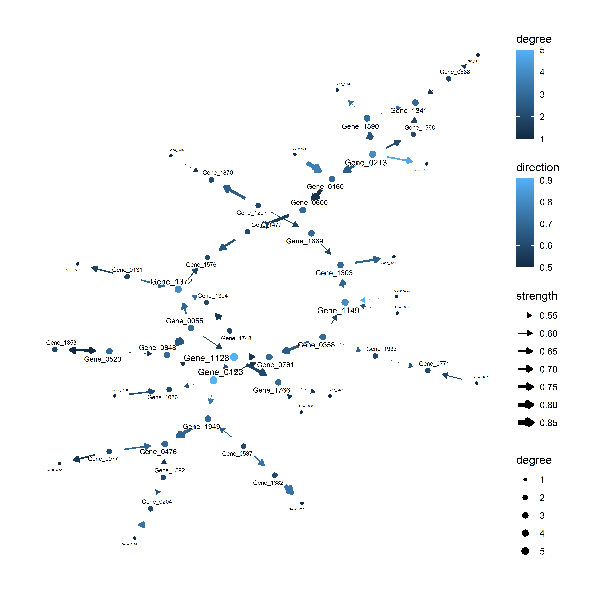
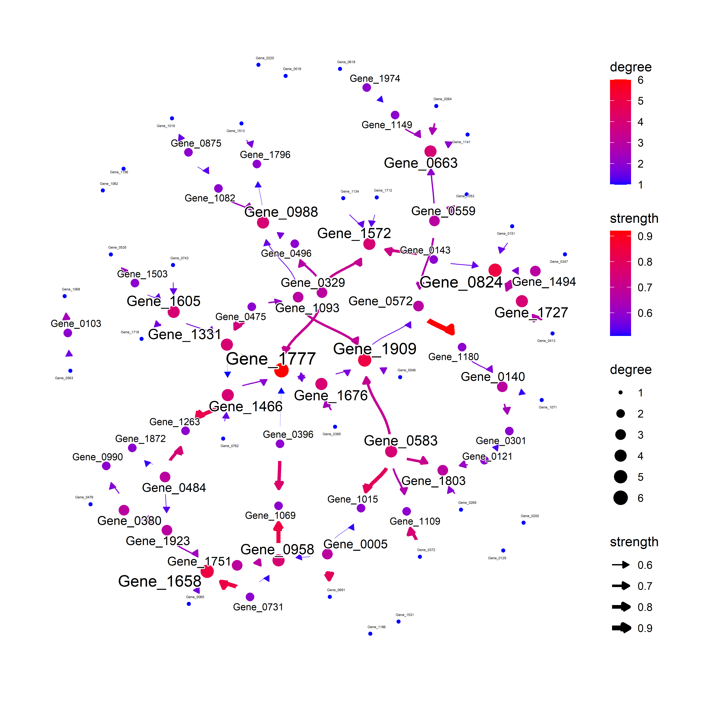

<!-- README.md is generated from README.Rmd. Please edit that file -->

# scstruc

The package for analysing the gene regulatory network based on the
Bayesian network structure of single-cell transcriptomics data. The
function works with `SingleCellExperiment`.

<!-- badges: start -->

[](https://github.com/noriakis/scstruc/actions/workflows/R-CMD-check.yaml)
<!-- badges: end -->

## Installation

Using `devtools`:

``` r
devtools::install_github("noriakis/scstruc")
```

For using the CCDr algorithm in the latest R version, please install
`ccdrAlgorithm` package from the following repository, which removes the
`||` usage error.

``` r
devtools::install_github("noriakis/ccdrAlgorithm")
```

## Examples

``` r
library(scran)
library(scstruc)
library(ggraph)
library(bnlearn)
sce <- mockSCE()
sce <- logNormCounts(sce)
included_genes <- sample(row.names(sce), 100)
gs <- scstruc(sce, included_genes, changeSymbol=FALSE)
plotNet(gs$net, gs$data, showText=FALSE)
```



Using the bootstrapping, the averaged network is obtained.

``` r
library(glmnet)
gs2 <- scstruc(sce, included_genes, algorithm="glmnet_BIC", boot=TRUE,
               changeSymbol=FALSE, R=20)
#> Bootstrapping specified
plotAVN(gs2$net, sizeRange=c(1,3))
```


