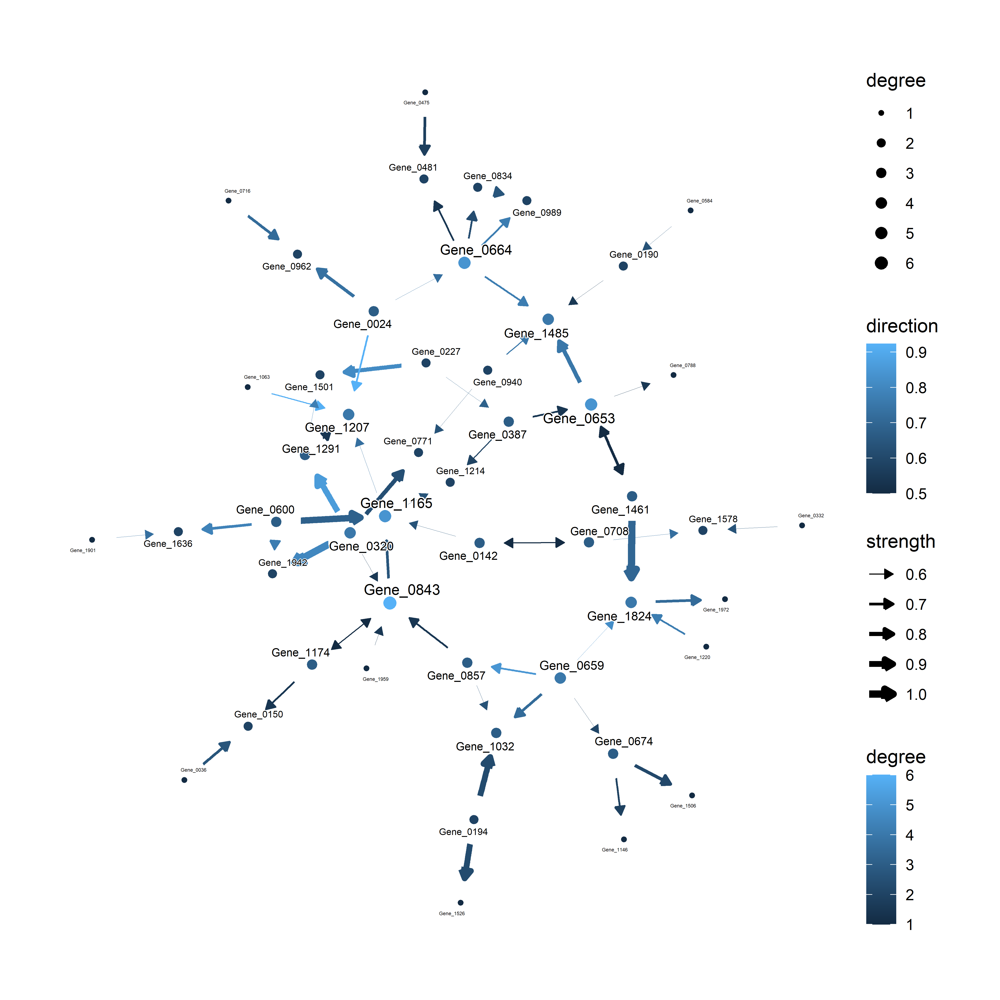

<!-- README.md is generated from README.Rmd. Please edit that file -->

# scstruc

The package for analysing the gene regulatory network based on the
Bayesian network structure of single-cell transcriptomics data. The
function works with `SingleCellExperiment` and `SpatialExperiment`.

## Installation

Using `devtools`:

``` r
devtools::install_github("noriakis/scstruc")
```

For using the CCDr algorithm in the latest R version, please install
`ccdrAlgorithm` package from the following repository, which removes the
`||` usage error.

``` r
devtools::install_github("noriakis/ccdrAlgorithm")
```

## Examples

``` r
library(scran)
library(scstruc)
library(bnlearn)
sce <- mockSCE()
sce <- logNormCounts(sce)
included_genes <- sample(row.names(sce), 100)
gs <- scstruc(sce, included_genes, changeSymbol=FALSE)
#> Using default bnlearn algorithm
fitted <- bn.fit(gs[[1]], gs[[2]])
ggraph(bn_fit_to_igraph(fitted), layout="fr") + 
  geom_edge_diagonal(aes(color=coef),
      arrow=arrow(type="closed", length=unit(2,"mm")),
      start_cap=circle(1,"mm"), end_cap=circle(1,"mm"))+
  geom_node_point()+
  theme_graph()
```


Using the bootstrapping, the averaged network is obtained.

``` r
library(glmnet)
gs2 <- scstruc(sce, included_genes, algorithm="glmnet_BIC.boot",
               changeSymbol=FALSE, algorithm.args=list("R"=20))
#> Bootstrapping specified
plotAVN(gs2$net)
```



Celltype-specific bootstrapped networks.

``` r
sce <- mockSCE()
sce2 <- mockSCE()
sces <- list(sce, sce2)
sces <- lapply(sces, function(x) logNormCounts(x))
sces <- lapply(sces, function(x) {
  colLabels(x) <- sample(c("Celltype_1","Celltype_2"), ncol(x), replace=TRUE)
  return(x)})

included_genes <- sample(row.names(sce), 50)
booted <- lapply(sces, function(x) {
  scstruc(x, included_genes,
    changeSymbol=FALSE,
    labelName="Celltype_1",
    label="label",
    algorithm="glmnet_CV.boot",
    algorithm.args=list("R"=10))
})
#> Bootstrapping specified
#> Bootstrapping specified
ce <- coreBootEdges(booted)
ce
#> # A tbl_graph: 44 nodes and 71 edges
#> #
#> # A directed multigraph with 1 component
#> #
#> # Node Data: 44 × 1 (active)
#>    name     
#>    <chr>    
#>  1 Gene_0017
#>  2 Gene_0196
#>  3 Gene_0728
#>  4 Gene_0080
#>  5 Gene_0221
#>  6 Gene_0714
#>  7 Gene_0111
#>  8 Gene_0689
#>  9 Gene_0114
#> 10 Gene_0639
#> # ℹ 34 more rows
#> #
#> # Edge Data: 71 × 4
#>    from    to strength direction
#>   <int> <int>    <dbl>     <dbl>
#> 1     1     2      0.8     0.875
#> 2     1     3      0.6     0.667
#> 3     4     5      1       0.9  
#> # ℹ 68 more rows
```
